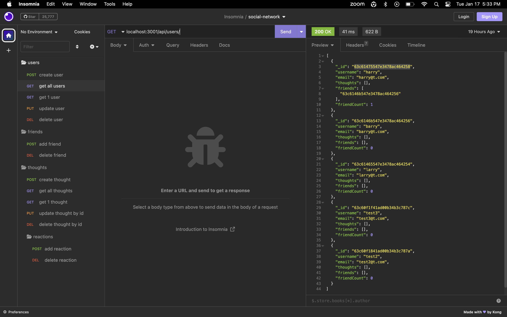

# Social Network API

## Description
MongoDB is a popular choice for many social networks due to its speed with large amounts of data and flexibility with unstructured data.

This is an API for a social network web application where users can share their thoughts, react to friends' thoughts, and create a friend list.



## Table of Contents
- [Description](#description)
- [User Story](#user-story)
- [Acceptance Criteria](#acceptance-criteria)
- [Installation](#installation)
- [Usage](#usage)
- [Tests](#tests)
- [Technology Used](#technology-used)
- [Questions](#questions)

## User Story

```md
AS A social media startup
I WANT an API for my social network that uses a NoSQL database
SO THAT my website can handle large amounts of unstructured data
```

## Acceptance Criteria

```md
GIVEN a social network API
WHEN I enter the command to invoke the application
THEN my server is started and the Mongoose models are synced to the MongoDB database
WHEN I open API GET routes in Insomnia for users and thoughts
THEN the data for each of these routes is displayed in a formatted JSON
WHEN I test API POST, PUT, and DELETE routes in Insomnia
THEN I am able to successfully create, update, and delete users and thoughts in my database
WHEN I test API POST and DELETE routes in Insomnia
THEN I am able to successfully create and delete reactions to thoughts and add and remove friends to a user’s friend list
```

## Installation

To install this application, clone the code into your terminal for the respective repository. Then, install dependencies by entering the command ```npm i```  into the terminal.

The server can then be run by entering ```npm run start``` into the command line, then opening Insomnia to use HTTP requests.

## Usage
1. Install npm: npm i
2. Start server: npm run start
3. Open Insomnia to send HTTP requests

## Tests


## Technology Used
- Node
- Express.js
- JavaScript
- Mongoose
- Insomnia

## Questions
My Github username is garrettohrt, which can be accessed here https://github.com/garrettohrt/social-network-api.

You can reach me at garrettohrt@gmail.com with additional questions.

Below is the link to my demo video:
- [Demo Video](https://drive.google.com/file/d/1o1ZJ4iJCrMPIXEfmmzPNRPHsd4J5gh7A/view?usp=sharing)